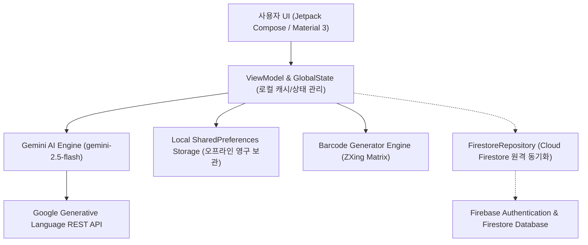

# 🌿 에코픽 (EcoPick) - AI 기반 우리 단지 배달 쓰레기 분리배출 도우미

[](https://developer.android.com)
[](https://kotlinlang.org/)
[](https://developer.android.com/jetpack/compose)
[](https://ai.google.dev/)
[](https://firebase.google.com/)
[](https://opensource.org/licenses/MIT)
[](https://yee.go.kr)

> **"사진 한 장으로 오염도 분석부터 세척 가이드, 단지 랭킹 리워드까지!"**  
> **2026 대한민국 청소년 창업경진대회 출품작**  
> **국립대학법인 서울대학교사범대학부설중학교 창업동아리 `SNUMS_psg`**  
> **공식 GitHub 저장소: [`mjayj9/eco_sort`](https://github.com/mjayj9/eco_sort)**

---

## 📌 목차 (Table of Contents)
1. [프로젝트 개요 및 브랜딩 (Overview & Branding)](#-프로젝트-개요-및-브랜딩-overview--branding)
2. [기획 배경 및 해결 과제 (Problem & Solution)](#-기획-배경-및-해결-과제-problem--solution)
3. [핵심 기능 및 어뷰징 방지 시스템 (Key Features & Anti-Abuse)](#-핵심-기능-및-어뷰징-방지-시스템-key-features--anti-abuse)
4. [환경 지표 및 탄소 저감 산출 근거 (Environmental Impact Metrics)](#-환경-지표-및-탄소-저감-산출-근거-environmental-impact-metrics)
5. [시스템 아키텍처 및 기술 스택 (Architecture & Tech Stack)](#-시스템-아키텍처-및-기술-스택-architecture--tech-stack)
6. [예외 상황 및 오류 처리 대응 (Error & Exception Handling)](#-예외-상황-및-오류-처리-대응-error--exception-handling)
7. [패키지 구조 및 상용 배포 안내 (Package & Deployment)](#-패키지-구조-및-상용-배포-안내-package--deployment)
8. [API 보안 및 알려진 한계 / 향후 로드맵 (Security & Roadmap)](#-api-보안-및-알려진-한계--향후-로드맵-security--roadmap)
9. [설치 및 테스트 실행 가이드 (Getting Started & Tests)](#-설치-및-테스트-실행-가이드-getting-started--tests)
10. [약관 및 개인정보 처리방침 (Terms & Privacy)](#-약관-및-개인정보-처리방침-terms--privacy)
11. [팀원 소개 및 역할 (Team & Roles)](#-팀원-소개-및-역할-team--roles)
12. [라이선스 (License)](#-라이선스-license)

---

## 🌟 프로젝트 개요 및 브랜딩 (Overview & Branding)

**에코픽(EcoPick, Repository: `eco_sort`)** 은 배달 음식 소비 급증으로 인해 발생하는 복합 재질 및 기름/양념 오염 배달 쓰레기의 올바른 분리배출을 돕는 **AI 멀티모달 비전 기반 친환경 리워드 플랫폼**입니다.

- **공식 서비스명**: 에코픽 (EcoPick)
- **GitHub 저장소 식별자**: `eco_sort`
- **핵심 가치**: 복합 재질 자동 식별, 오염도(0~100%) 추정 및 맞춤 세척 가이드, 우리 단지 랭킹(ESG 게이미피케이션), 모바일 바코드 리워드 즉시 교환

사용자가 배달 용기나 쓰레기를 스마트폰 카메라로 촬영하면, **Google Gemini 2.5 Flash** 멀티모달 모델이 실시간으로 쓰레기의 **재질(PP, PS, PET, 종이 등)과 오염도(0~100%)를 분석**하여 세척 가이드와 분리배출 등급을 제공합니다. 올바른 실천을 인증하면 **에코 포인트**가 적립되며, 아파트 단지 간 **친환경 실시간 랭킹 경쟁**을 통해 자발적이고 지속 가능한 분리배출 문화를 조성합니다.

---

## 💡 기획 배경 및 해결 과제 (Problem & Solution)

### 🚨 당면한 문제 (Problem)
1. **오염된 배달 용기의 재활용 불가율 증가**: 배달 용기 플라스틱은 양념이나 기름때가 남아있으면 선별장에서 전량 일반 쓰레기(소각/매립)로 폐기됩니다.
2. **복합 재질 분리배출 지식 부족**: 뚜껑(PP), 본체(PS), 비닐 실링, 흡습패드 등 복합 포장재의 분리 방법을 소비자가 정확히 알기 어렵습니다.
3. **지속적인 실천 동기 부재**: 분리배출을 열심히 해도 개인이나 공동체에 돌아오는 실질적인 혜택이 없어 참여율이 저조합니다.

### 💡 에코픽의 해결 솔루션 (Solution)
- **AI 멀티모달 비전 추정**: 사진을 촬영하면 Gemini 2.5 Flash AI가 오염도를 추정(%)하고, "기름때 제거를 위해 베이킹소다나 따뜻한 물로 헹구세요" 등 맞춤 행동 요령을 제시.
- **빈틈없는 차등 리워드 시스템**: 오염도 구간별 등급(A/B/C/F)에 따른 에코 포인트 즉시 지급.
- **아파트 단지 대항전(ESG 게이미피케이션)**: 우리 단지의 분리배출율, 탄소 저감량, 처리비용 절감액을 집계하여 주민들의 소속감과 참여율 증대.
- **모바일 쿠폰샵 연계**: 적립된 포인트로 편의점 상품권, 배달 할인쿠폰, 커피 기프티콘 등으로 실시간 교환.

---

## 🚀 핵심 기능 및 어뷰징 방지 시스템 (Key Features & Anti-Abuse)

### 1. 📷 AI 멀티모달 비전 스캐너 (`AiScannerScreen.kt`)
- **실시간 카메라 촬영 & 갤러리 업로드**: 직관적인 카메라 인터페이스 및 사진 즉시 미리보기.
- **Google Gemini 2.5 Flash 심층 분석 (`GeminiApiService.kt`)**:
  - 품목 및 재질 식별 (예: 치킨 박스, 마라탕 플라스틱 용기, 페트병 등)
  - 오염도 비전 추정 (0% ~ 100%)
  - 세부 액션 플랜 (라벨 제거, 이물질 세척, 뚜껑 분리 등)
  - 장애 대비 `gemini-2.5-flash-lite` Fallback 엔드포인트 자동 전환

#### 🎯 빈틈없는 오염도 등급 및 리워드 기준표 (`EcoGradeCalculator.kt`)
| 등급 | 오염도 구간 | 상태 설명 | 분리배출 요령 | 적립 포인트 |
|:---:|:---:|:---|:---|:---:|
| **A등급** | `0.0% ~ 10.0%` 이하 | 깨끗하게 비워진 상태 | 라벨/뚜껑 분리 후 전용 수거함 배출 | **+100P** |
| **B등급** | `10.0% 초과 ~ 30.0%` 이하 | 가벼운 물자국 또는 옅은 오염 | 미온수로 1회 헹군 뒤 분리배출 | **+70P** |
| **C등급** | `30.0% 초과 ~ 60.0%` 이하 | 양념 얼룩 및 기름기 오염 | 주방세제/베이킹소다 세척 후 배출 | **+40P** |
| **F등급** | `60.0% 초과` | 짙은 착색 및 세척 불가 상태 | 재활용 불가, 종량제 봉투(일반쓰레기) 배출 | **0P** |

#### 🛡️ 다중 계층 포인트 어뷰징 방지 시스템 (Anti-Abuse Engine)
1. **이미지 해시 (SHA-256) 중복 검증**: 동일한 이미지나 이전 인증 사진을 재사용할 경우 즉시 차단.
2. **일일 인증 및 적립 상한선**: 1인당 하루 최대 **15회 인증 / 1,500P**까지만 적립 가능하도록 제한.
3. **2단계 배출 장소 배경 검증**: 쓰레기 사진 분석 후 2차로 분리수거장(클린하우스/수거함) 배경 사진을 AI로 검증.
4. **연속 제출 쿨다운**: 분석 후 최소 2초의 물리적 시차 검증 적용.

### 2. 🏢 우리 단지 대시보드 & 랭킹 (`DashboardScreen.kt`)
- **단지별 실시간 랭킹**: 래미안 에코팰리스, 자이 더 그린 등 아파트 단지 배출 실적 비교.
- **친환경 환경 지표 시각화**: 누적 탄소 저감량, 쓰레기 처리비용 절감액, 배출 요일 캘린더 안내.
- **관리자 전용 공지사항 시스템**: 관리사무소 계정으로 로그인 시 단지 공지사항 작성 및 관리.

### 3. 🎁 에코 포인트샵 (`PointShopScreen.kt`)
- **모바일 제휴 상품**: 편의점 모바일 상품권, 배달앱 할인쿠폰, 커피 음료 교환권 등.
- **원클릭 교환 & 즉시 바코드 발급**: ZXing 기반 오프라인 스캔 가능 바코드 렌더러 (`BarcodeUtils.kt`).
- **보유 쿠폰함 및 교환 이력 관리**: 사용 완료 / 사용 전 쿠폰 상태 분류.
- *※ 표시된 브랜드(GS25, 스타벅스, 배달의민족 등)는 대회 시연을 위한 프로토타입 예시 데이터입니다.*

### 4. 🔐 계정 및 인증 시스템 (`LoginScreen.kt`, `SettingsScreen.kt`)
- **회원가입 / 로그인 / Google 1-Tap 연동**: 이메일 유효성 검사, 단지 선택, 약관 동의.
- **알림 설정**: 분리배출일, 포인트 적립, 단지 순위 변동 알림 개별 토글.
- **비밀번호 재설정 & 회원 탈퇴/데이터 초기화**.

---

## 📊 환경 지표 및 탄소 저감 산출 근거 (Environmental Impact Metrics)

대시보드에 표기되는 통계는 공인 환경 통계를 기반으로 산출된 공식 추정치입니다:

| 지표명 | 환산 계수 (1건당) | 산출 근거 및 공식 출처 |
|:---|:---:|:---|
| **온실가스 감축량** | **0.3 kg CO₂e** | **환경부 국가 온실가스 배출계수**: 1kg PET/PP 재활용 시 약 1.5kg CO₂e 감축 (용기 1개 평균 200g 환산 시 0.3kg 감축) |
| **처리 비용 절감액** | **50 원** | **한국환경공단 2023 폐기물 통계**: 종량제 생활폐기물 수거·운반 및 소각/매립 위탁 처리 단가 기준 |
| **수자원 절약량** | **2.0 L** | **자원순환보증금관리센터**: 플라스틱 신규 생산 대비 재활용 공정 수자원 절감 계수 |

---

## 🛠 시스템 아키텍처 및 기술 스택 (Architecture & Tech Stack)

에코픽은 오프라인 환경에서도 100% 원활하게 동작하는 **오프라인 우선 하이브리드 아키텍처(Offline-First Hybrid Architecture)** 로 설계되었습니다.



| 구분 | 기술 스택 | 설명 |
| :--- | :--- | :--- |
| **OS / Platform** | Android (minSdk 24, targetSdk 36) | 최신 모바일 안드로이드 14/15 환경 지원 |
| **Language** | Kotlin 1.9+ | 100% Kotlin 기반 코루틴 및 비동기 처리 |
| **UI Framework** | Jetpack Compose & Material 3 | 선언형 UI, 접근성 준수(최소 48dp 터치 타깃), 다크/라이트 테마 |
| **AI / Vision** | Google Gemini 2.5 Flash REST API | 멀티모달 비전 프롬프트 엔지니어링 및 JSON 스키마 파싱 |
| **Backend & Sync** | Cloud Firestore + Firebase Auth | 다중 단지 실시간 랭킹 및 포인트 트랜잭션 동기화 |
| **Local Storage** | SharedPreferences & StateFlow | 오프라인 세션 영구 보관 및 빠른 반응 속도 보장 |
| **Security Rules** | `firestore.rules` | 사용자별/단지별 권한 분리 및 안전한 읽기/쓰기 정책 적용 |

---

## ⚠️ 예외 상황 및 오류 처리 대응 (Error & Exception Handling)

| 예외 상황 | 앱의 대응 메커니즘 | 사용자 안내 메시지 |
|:---|:---|:---|
| **네트워크 끊김 / 오프라인** | 로컬 픽셀 컬러 히스토그램 기반 **휴리스틱 비전 분석기** 자동 전환 | "네트워크 연결이 없어 로컬 비전 모드로 분석을 완료했습니다." |
| **API 분당 할당량 초과 (HTTP 429)** | `gemini-2.5-flash-lite` Fallback 엔드포인트 자동 전환 | "요청이 집중되어 경량 모델로 신속하게 분석했습니다." |
| **JSON 파싱 실패 / 포맷 오류** | 정규식 기반 JSON 정제 후 안전 파싱 (Safe Extraction) | 파싱 실패 시 기본 안전 가이드로 롤백 |
| **카메라 / 갤러리 권한 거부** | Jetpack Compose 권한 요청 런처 및 설정 이동 안내 다이얼로그 | "사진 촬영을 위해 카메라 권한 허용이 필요합니다." |
| **쓰레기가 아닌 사진 업로드** | Gemini AI의 `"판독_성공": false` 플래그 감지 | "쓰레기 객체를 식별할 수 없습니다. 밝은 조명에서 다시 촬영해주세요." |

---

## 📦 패키지 구조 및 상용 배포 안내 (Package & Deployment)

- **AI Studio 개발 환경**: 개발 툴체인 기준 `namespace = "com.example"` 및 `applicationId = "com.aistudio.ecosort.jviyel"`
- **상용 배포 시 가이드**:
  - Google Play Store 배포 시 `build.gradle.kts`의 `applicationId` 및 `namespace`를 `kr.snums.ecopick`으로 일괄 변경하여 릴리스 빌드를 생성합니다.

---

## 🔒 API 보안 및 알려진 한계 / 향후 로드맵 (Security & Roadmap)

1. **현재 프로토타입 시연 환경**:
   - `BuildConfig.GEMINI_API_KEY`를 통해 안전하게 주입되거나, 사용자가 [설정] 메뉴에서 테스트용 커스텀 API Key를 입력할 수 있습니다.
2. **알려진 한계 (Known Limitations)**:
   - **클라이언트 API 직접 호출**: 현재 프로토타입은 모바일 클라이언트에서 직접 Gemini API를 호출하므로 역컴파일 시 보안 취약점이 존재할 수 있습니다.
   - **AI 영상 추정의 한계**: 촬영 각도나 조명에 따라 오염도 수치에 오차가 발생할 수 있습니다.
3. **향후 로드맵 (Roadmap)**:
   - **백엔드 프록시 서버 구축**: Firebase Cloud Functions 또는 Google Cloud Run을 도입하여 API 키를 서버 측에 은닉.
   - **지자체 공공데이터 API 연동**: 전국 시·군·구별 분리배출 세부 조례 실시간 연동.
   - **단지 관리사무소 IoT 수거함 연동**: 스마트 수거함 하드웨어와 블루투스/NFC 비콘 연동.

---

## 💻 설치 및 테스트 실행 가이드 (Getting Started & Tests)

### 1. 전제 조건 (Prerequisites)
- Android Studio Hedgehog (2023.1.1) 이상 또는 Google AI Studio Build 환경
- JDK 17 이상
- Android SDK 36 (Android 14/15)
- (선택) 개별 Google Gemini API Key ([Google AI Studio](https://aistudio.google.com/)에서 무료 발급)

### 2. 프로젝트 클론 및 열기
```bash
git clone https://github.com/mjayj9/eco_sort.git
cd eco_sort
```

### 3. API 키 설정 (Environment Configuration)
프로젝트 루트의 `.env` 파일 또는 시스템 환경 변수에 API 키를 등록하거나, 앱 내 **[설정] > [Gemini AI API 설정]** 메뉴에서 직접 입력할 수 있습니다.
```properties
GEMINI_API_KEY=your_gemini_api_key_here
```

### 4. 빌드 및 테스트 실행
```bash
# 디버그 APK 빌드 (Linux/macOS)
./gradlew assembleDebug

# Windows 환경
gradlew.bat assembleDebug

# 핵심 등급 산정 및 JSON 파싱 단위 테스트 실행
./gradlew :app:testDebugUnitTest
```

---

## 📄 약관 및 개인정보 처리방침 (Terms & Privacy)

에코픽은 사용자의 소중한 개인정보를 안전하게 보호하며, 관련 법령 및 규정을 철저히 준수합니다.
- 📜 [서비스 이용약관 전문 보기 (TERMS.md)](TERMS.md)
- 🔒 [개인정보 처리방침 전문 보기 (PRIVACY.md)](PRIVACY.md)

---

## 👥 팀원 소개 및 역할 (Team & Roles)

**국립대학법인 서울대학교사범대학부설중학교 창업동아리 `SNUMS_psg`**

| 이름 | 역할 | 담당 업무 |
| :---: | :---: | :--- |
| **정○○** | **대표 / 메인 개발** | • 프로젝트 총괄 및 안드로이드 아키텍처 설계<br>• Jetpack Compose UI 및 전역 상태 관리 구현<br>• Google Gemini 2.5 Flash 비전 API 연동 및 네트워크 계층 설계 |
| **채○○** | **코어 개발 / QA** | • AI 분석 결과 JSON 파싱 및 오염도 등급 알고리즘 구현<br>• 포인트샵 바코드 발급 엔진 개발 및 빌드 테스트 |
| **김○○** | **기획 / 기술 문서** | • 비즈니스 모델(BM) 수립 및 2026 청소년 창업경진대회 사업계획서 작성<br>• 서비스 이용약관 및 아파트 단지 리워드 정책 기획 |
| **정○○** | **개발 보조 / 리서치** | • 재질별(PP, PS, PET 등) 분리배출 표준 가이드 DB 리서치<br>• 대시보드 통계 지표(탄소 저감량 환산식) 검증 |

---

## 📄 라이선스 (License)

본 프로젝트는 [MIT License](LICENSE)에 따라 자유롭게 수정 및 배포할 수 있습니다.  
Copyright © 2026 SNUMS_psg (Seoul National University Middle School). All rights reserved.
